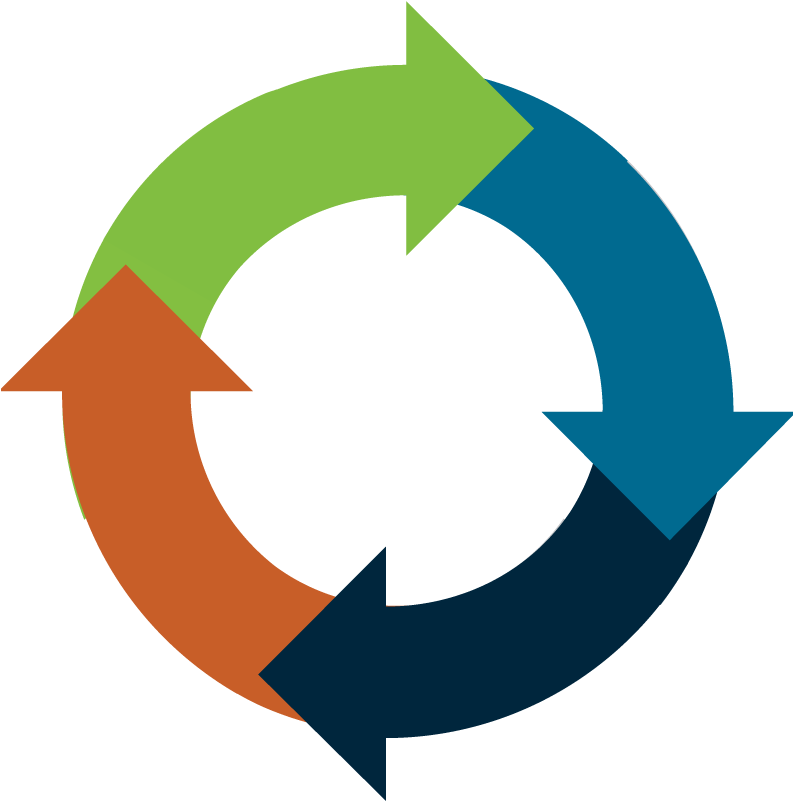

<div id="top"></div>

<!-- PROJECT SHIELDS -->
<!--
*** I'm using markdown "reference style" links for readability.
*** Reference links are enclosed in brackets [ ] instead of parentheses ( ).
*** See the bottom of this document for the declaration of the reference variables
*** for contributors-url, forks-url, etc. This is an optional, concise syntax you may use.
*** https://www.markdownguide.org/basic-syntax/#reference-style-links
-->
[![Contributors][contributors-shield]][contributors-url]
[![Forks][forks-shield]][forks-url]
[![Stargazers][stars-shield]][stars-url]
[![Issues][issues-shield]][issues-url]
[![MIT License][license-shield]][license-url]
<!-- [![LinkedIn][linkedin-shield]][linkedin-url] -->


<!-- PROJECT LOGO -->
<br />
<div align="center">
  <a href="https://github.com/RobertSmithers/NatureNews">
    
  </a>

<h3 align="center">NatureNews</h3>

  <p align="center">
    This Artificial Intelligence program gathers the top 5 pieces of news in the Life Cycle Assessment domain and summarizes each one.
    <br />
    <br />
    <a href="https://github.com/RobertSmithers/NatureNews/issues">Report Bug</a>
    ·
    <a href="https://github.com/RobertSmithers/NatureNews/issues">Request Feature</a>
  </p>
</div>


<!-- TABLE OF CONTENTS -->
<details>
  <summary>Table of Contents</summary>
  <ol>
    <li>
      <a href="#about-the-project">About The Project</a>
      <ul>
        <li><a href="#built-with">Built With</a></li>
      </ul>
    </li>
    <li>
      <a href="#getting-started">Getting Started</a>
      <ul>
        <li><a href="#prerequisites">Prerequisites</a></li>
        <li><a href="#installation">Installation</a></li>
      </ul>
    </li>
    <li><a href="#usage">Usage</a></li>
    <li><a href="#roadmap">Roadmap</a></li>
    <li><a href="#contributing">Contributing</a></li>
    <li><a href="#license">License</a></li>
    <li><a href="#contact">Contact</a></li>
    <li><a href="#acknowledgments">Acknowledgments</a></li>
  </ol>
</details>


<!-- ABOUT THE PROJECT -->
## About The Project

TBD

<!-- [![Product Art][art1]](https://github.com/RobertSmithers/NatureNews)
[![Product Art][art1]](https://github.com/RobertSmithers/NatureNews) -->

<p align="right">(<a href="#top">back to top</a>)</p>


### Built With

* [Gensim](https://pypi.org/project/gensim/)
* [PyTorch](https://pytorch.org/)

<p align="right">(<a href="#top">back to top</a>)</p>


<!-- GETTING STARTED -->
## Getting Started

### Demo (TBD)
```

```

<!-- ### Prerequisites

This is an example of how to list things you need to use the software and how to install them. It is recommended to install these within a virtual environment within the repository.

* PyTorch
  ```sh
  pip install torch
  ```

* PyTorch3D
  ```sh
  pip install "git+https://github.com/facebookresearch/pytorch3d.git@stable"
  ``` -->

### Installation

1. Clone the repo
   ```sh
   git clone https://github.com/RobertSmithers/NatureNews.git
   ```
2. (Optional) Create a virtual environment
3. Install all required prerequisites

<p align="right">(<a href="#top">back to top</a>)</p>


<!-- USAGE EXAMPLES -->
## Usage

TBD

<p align="right">(<a href="#top">back to top</a>)</p>


<!-- ROADMAP -->
## Roadmap

- [] TBD
- [] TBD
- [] TBD

See the [open issues](https://github.com/RobertSmithers/NatureNews/issues) for a full list of proposed features (and known issues).

<p align="right">(<a href="#top">back to top</a>)</p>

<!-- CONTRIBUTING -->
## To Contribute

Contributions are what make the open source community such an amazing place to learn, inspire, and create. Any contributions you make are **greatly appreciated**.

If you have a suggestion that would make this better, please fork the repo and create a pull request. You can also simply open an issue with the tag "enhancement".
Don't forget to give the project a star! Thanks again!

1. Fork the Project
2. Create your Feature Branch (`git checkout -b feature/AmazingFeature`)
3. Commit your Changes (`git commit -m 'Add some AmazingFeature'`)
4. Push to the Branch (`git push origin feature/AmazingFeature`)
5. Open a Pull Request

<p align="right">(<a href="#top">back to top</a>)</p>


<!-- LICENSE -->
## License

Distributed under the MIT License. See `LICENSE.txt` for more information.

<p align="right">(<a href="#top">back to top</a>)</p>


<!-- CONTACT -->
## Contact

Robert Smithers - [Website](https://robertsmithers.github.io/) - rjsmithers3@gmail.com

<p align="right">(<a href="#top">back to top</a>)</p>


<!-- ACKNOWLEDGMENTS -->
## Acknowledgments

* [TextRank vs Seq2Seq vs Bart - Medium](https://towardsdatascience.com/text-summarization-with-nlp-textrank-vs-seq2seq-vs-bart-474943efeb09)

<p align="right">(<a href="#top">back to top</a>)</p>

<div align="center">
    
</div>

<!-- MARKDOWN LINKS & IMAGES -->
<!-- https://www.markdownguide.org/basic-syntax/#reference-style-links -->
[contributors-shield]: https://img.shields.io/github/contributors/RobertSmithers/NatureNews.svg?style=for-the-badge
[contributors-url]: https://github.com/RobertSmithers/NatureNews/graphs/contributors
[forks-shield]: https://img.shields.io/github/forks/RobertSmithers/NatureNews.svg?style=for-the-badge
[forks-url]: https://github.com/RobertSmithers/NatureNews/network/members
[stars-shield]: https://img.shields.io/github/stars/RobertSmithers/NatureNews.svg?style=for-the-badge
[stars-url]: https://github.com/RobertSmithers/NatureNews/stargazers
[issues-shield]: https://img.shields.io/github/issues/RobertSmithers/NatureNews.svg?style=for-the-badge
[issues-url]: https://github.com/RobertSmithers/NatureNews/issues
[license-shield]: https://img.shields.io/github/license/RobertSmithers/NatureNews.svg?style=for-the-badge
[license-url]: https://github.com/RobertSmithers/NatureNews/blob/main/LICENSE
[linkedin-shield]: https://img.shields.io/badge/-LinkedIn-black.svg?style=for-the-badge&logo=linkedin&colorB=555
<!-- [linkedin-url]: https://linkedin.com/in/linkedin_username -->
[product-screenshot]: images/footer.png
[teeth-art1]: images/input.png
[teeth-art2]: images/predicted.png